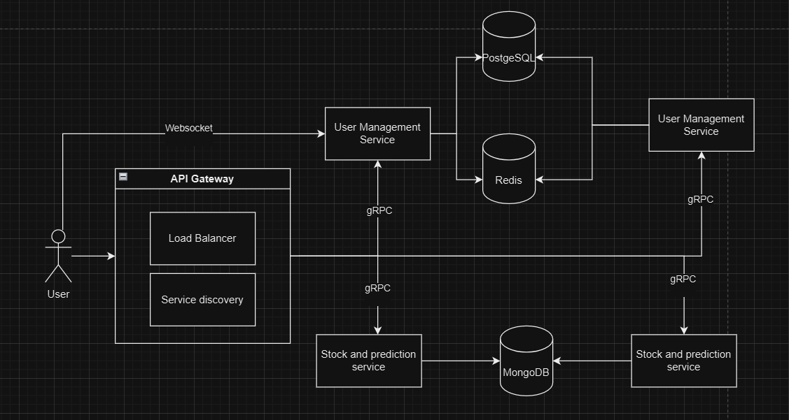

# Machine Learning Stock Price Prediction
## Application Suitability
1. **Why is this application relevant?**
* **Investment Insights:** A stock price prediction system can provide investors with insights to make more informed buy or sell decisions. By leveraging machine learning, this system can potentially increase accuracy in predicting stock trends.
* **Data-Driven Decision Making:** As financial markets fluctuate based on numerous factors, having access to historical data and predictive analysis allows users to make data-driven decisions, reducing reliance on emotional trading or speculation.

2. **Why does this application require a microservice architecture?**
* **Modularity and Maintainability:** Each component (data retrieval, prediction, and user management) can be developed and tested independently, making it easier to manage
* **Future Expandability:** It is going to be easier ater to  add more features (like additional prediction strategies) without overhauling the entire system.

Real-world examples of similar systems using microservices:

- **Robinhood**: A stock trading platform that handles real-time stock data and user management.
- **Alpaca**: A commission-free API for algorithmic trading, integrating microservices for data fetching and trade execution.
- **QuantConnect**: A cloud-based platform for algorithmic trading and backtesting, using microservices for data processing and prediction models.


## Service Boundaries



* **Stock Prediction Service:** Fetches historical stock data from an external API and Uses a machine learning model to generate "buy" or "sell" signals based on historical stock data.
* **User Management Service::**  Manages user registration, authentication, and profile information using MongoDB. 

## Technology Stack and Communication Patterns

### Technology Stack and Communication Patterns

1. **API Gateway**:
   - **Language**: Node.js
   - **Framework**: Express (RESTful API)
   - **Purpose**: Routes user requests to the Stock Data Service and Prediction Service, and handles WebSocket connections for real-time updates.

2. **Stock Data Service**:
   - **Language**: Python
   - **Framework**: Flask
   - **External API**: Alpha Vantage (for stock data)
   - **Cache**: Redis (for caching stock data)
   - **Purpose**: Purpose: Fetches and caches historical stock data, communicates with the API Gateway via gRPC.

3. **Prediction Service**:
   - **Language**: Python
   - **Framework**: Flask
   - **ML Library**: Scikit-learn (for predictions)
   - **Database**: PostgreSQL (for storing predictions)
   - **Purpose**: Purpose: Analyzes stock data, generates predictions, and sends real-time updates via gRPC to the API Gateway.

4. **WebSocket**:
   - **Technology**:  Node.js with Socket.IO (integrated into the API Gateway)
   - **Purpose**: Provides real-time updates to multiple users in dynamic rooms (based on stock symbols).


## Data Management
# Stock Prediction Service

### Endpoints:
- **/api/stocks/<symbol>/details** - Retrieves stock details for the given symbol.
- **/api/predict/<symbol>** - Generates stock prediction for the given symbol.
- **/api/transactions/store** - Stores transaction details.


### Endpoint: `/api/stocks/<symbol>/details`
- **Method**: `GET`
- **Description**: Retrieves stock details for the given symbol.

**Responses:**
- **200 OK:**
    ```json
    {
      "id": "string",
      "symbol": "string",
      "price": "string",
      "currency": "string"
    }
    ```
- **404 Not Found:**
    ```json
    {
      "error": "Stock data not available"
    }
    ```

---

### Endpoint: `/api/predict/<symbol>`
- **Method**: `GET`
- **Description**: Generates a stock prediction for the given symbol.

**Responses:**
- **200 OK:**
    ```json
    {
      "symbol": "string",
      "prediction": "number",
      "action": "buy | sell",
      "timestamp": "string",
      "_id": "string"
    }
    ```
- **404 Not Found:**
    ```json
    {
      "error": "Stock data not available"
    }
    ```

---

### Endpoint: `/api/transactions/store`
- **Method**: `POST`
- **Description**: Stores transaction details.
- **Received Data:**
    ```json
    {
      "user_id": "string",
      "symbol": "string",
      "quantity": "number",
      "action": "buy | sell",
      "price": "number",
      "timestamp": "string"
    }
    ```

**Responses:**
- **201 Created:**
    ```json
    {
      "message": "Transaction stored successfully"
    }
    ```
- **500 Internal Server Error:**
    ```json
    {
      "error": "Internal Server Error"
    }
    ```

---

# User Management Service

### Endpoints:
- **/api/users/register** - Registers a new user.
- **/api/users/login** - Authenticates a user.
- **/api/users/profile** - Retrieves user profile.
- **/api/users/profile/update** - Updates user profile.
- **/api/users/buy** - Processes a stock buy request.
- **/api/users/sell** - Processes a stock sell request.

---

### Endpoint: `/api/users/register`
- **Method**: `POST`
- **Description**: Registers a new user.
- **Received Data:**
    ```json
    {
      "name": "string",
      "email": "string",
      "password": "string"
    }
    ```

**Responses:**
- **201 Created:**
    ```json
    {
      "message": "User registered successfully",
      "user_id": "string"
    }
    ```
- **400 Bad Request:**
    ```json
    {
      "error": "Invalid input data"
    }
    ```
- **409 Conflict:**
    ```json
    {
      "error": "User already exists"
    }
    ```

---

### Endpoint: `/api/users/login`
- **Method**: `POST`
- **Description**: Authenticates a user.
- **Received Data:**
    ```json
    {
      "email": "string",
      "password": "string"
    }
    ```

**Responses:**
- **200 OK:**
    ```json
    {
      "message": "Login successful",
      "token": "string"
    }
    ```
- **401 Unauthorized:**
    ```json
    {
      "error": "Invalid credentials"
    }
    ```
- **400 Bad Request:**
    ```json
    {
      "error": "Invalid input data"
    }
    ```

---

### Endpoint: `/api/users/profile`
- **Method**: `GET`
- **Description**: Retrieves the user's profile.
- **Headers**: `Authorization: Bearer token`


**Responses:**
- **200 OK:**
    ```json
    {
      "user_id": "string",
      "name": "string",
      "email": "string"
    }
    ```
- **401 Unauthorized:**
    ```json
    {
      "error": "Invalid or missing token"
    }
    ```

---

### Endpoint: `/api/users/profile/update`
- **Method**: `POST`
- **Description**: Updates the user's profile.
- **Headers**: `Authorization: Bearer token`
- **Received Data:**
    ```json
    {
      "name": "string",
      "email": "string"
    }
    ```

**Responses:**
- **200 OK:**
    ```json
    {
      "message": "Profile updated successfully"
    }
    ```
- **400 Bad Request:**
    ```json
    {
      "error": "Invalid input data"
    }
    ```
- **401 Unauthorized:**
    ```json
    {
      "error": "Invalid or missing token"
    }
    ```

---

### Endpoint: `/api/users/buy`
- **Method**: `POST`
- **Description**: Processes a stock buy request.
- **Received Data:**
    ```json
    {
      "user_id": "string",
      "symbol": "string",
      "quantity": "number"
    }
    ```

**Responses:**
- **200 OK:**
    ```json
    {
      "message": "Stock bought successfully",
      "transaction_id": "string"
    }
    ```
- **400 Bad Request:**
    ```json
    {
      "error": "Invalid input data"
    }
    ```
- **500 Internal Server Error:**
    ```json
    {
      "error": "An error occurred processing the buy request"
    }
    ```

---

### Endpoint: `/api/users/sell`
- **Method**: `POST`
- **Description**: Processes a stock sell request.
- **Received Data:**
    ```json
    {
      "user_id": "string",
      "symbol": "string",
      "quantity": "number"
    }
    ```

**Responses:**
- **200 OK:**
    ```json
    {
      "message": "Stock sold successfully",
      "transaction_id": "string"
    }
    ```
- **400 Bad Request:**
    ```json
    {
      "error": "Invalid input data"
    }
    ```
- **500 Internal Server Error:**
    ```json
    {
      "error": "An error occurred processing the sell request"
    }
    ```


## Deployment and Scaling

### Build the Docker Images
Use Docker Compose to build all the Docker images for the services:
```bash
docker-compose build
```

### Start the Services
Start all the services defined in the docker-compose.yml file:
```bash
docker-compose up
```

### Verify That the Services Are Running
Check the status of the containers:
```bash
docker-compose ps
```
# Circuit Breaker Pattern
The Circuit Breaker Pattern helps prevent cascading failures by detecting repetitive errors in service calls. This pattern isolates failing services temporarily, ensuring that issues in the Prediction and Stock Data Services do not impact the entire system. The API Gateway applies circuit breaker policies to improve resilience and maintain stability.

---

# ELK Stack
The ELK Stack — Elasticsearch, Logstash, and Kibana — provides centralized logging and monitoring across services. Elasticsearch stores logs, Logstash collects logs from each service, and Kibana visualizes them. This stack enables real-time monitoring and simplifies troubleshooting, ensuring efficient system performance and quick issue resolution.

---

# Two-Phase Commit for Transaction Consistency
The Two-Phase Commit protocol ensures consistency in distributed transactions across services. By using a two-step process (Prepare and Commit), this protocol guarantees that transactions either complete successfully across all services or roll back entirely, maintaining data integrity within Prediction and Stock Data Services.

---

# Consistent Hashing for Cache
Consistent Hashing in Redis enables even distribution of cached data across nodes, reducing cache misses and improving response times. This technique helps maintain a scalable caching layer, enhancing the system's ability to handle high transaction volumes with optimal performance.

---

# Cache High Availability
Cache High Availability is achieved through a master-slave setup in Redis, providing redundancy. In case of node failure, the system switches to replica nodes, ensuring uninterrupted cache access and improved reliability for frequent requests.

---

# Data Warehouse and ETL
The Data Warehouse and ETL process consolidates data across services, supporting advanced analytics and reporting. This setup enables data-driven insights for performance monitoring and strategic decision-making, enhancing service quality and predictive accuracy.
